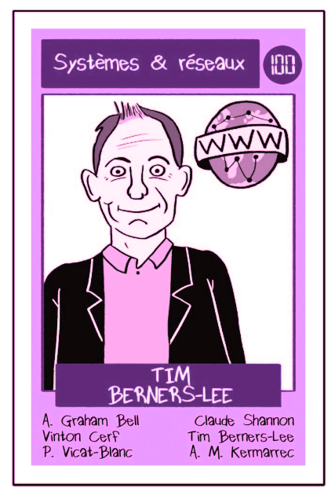
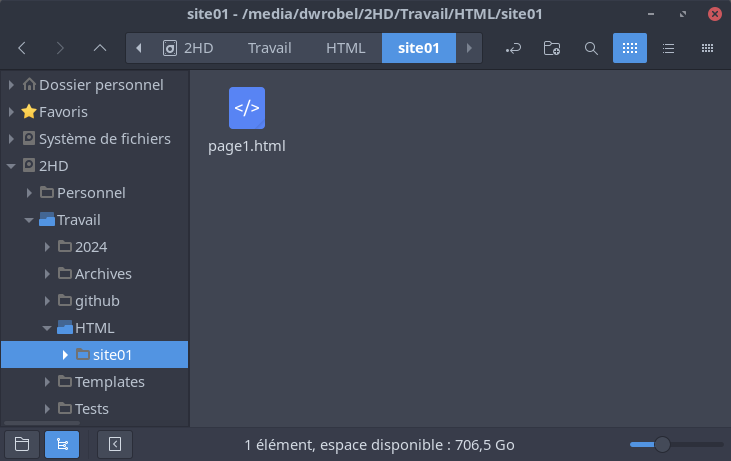
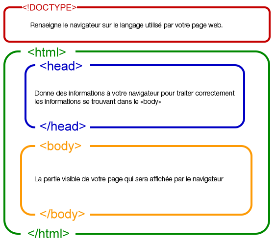
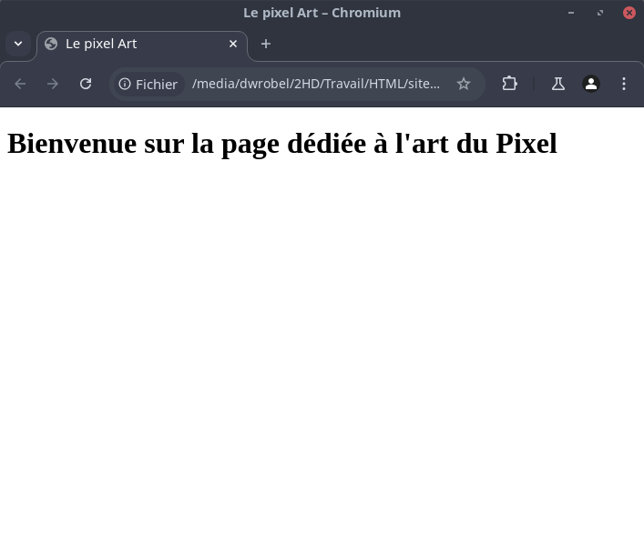
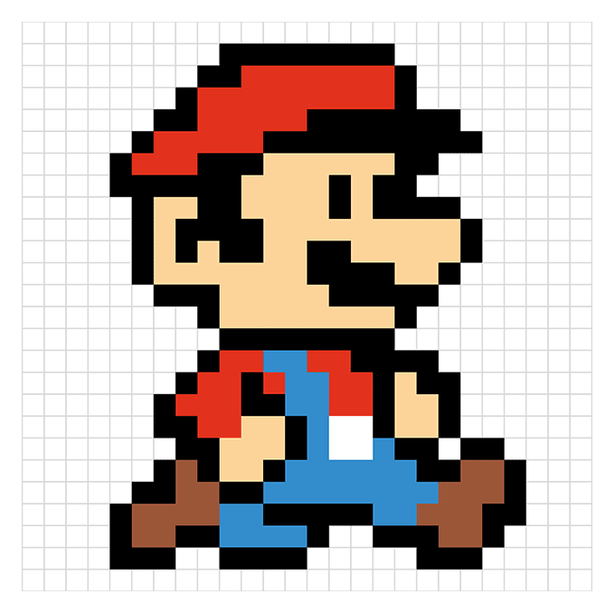

# Le langage HTML

## Pour commencer

### Un peu d'histoire

!!! info "Quelques définitions"

    **HTML** signifie « HyperText Markup Language » qu'on peut traduire par « langage de balises pour l'hypertexte ».

    L'**« hypertexte »** désigne les liens qui relient les pages web entre elles, que ce soit au sein d'un même site web ou entre différents sites web.  
    Les liens sont un aspect fondamental du Web. Ce sont eux qui forment cette « toile » (ce mot est traduit par web en anglais).

!!! tip "Un peu d'histoire"

    C'est Tim Berners-Lee qui a inventé le Web alors qu'il travaillait au CERN.

    <center>
        
    </center>

    Le premier site internet est toujours consultable en cliquant [ici](https://info.cern.ch/hypertext/WWW/TheProject.html){:target="_blank"}

### Les grands principes

Le langage HTML utilise des **« balises »** pour annoter du texte, des images et d'autres contenus afin de les afficher dans un navigateur web. 
Il n'est pas nécessaire d'être connecté à internet pour afficher une page Web enregistrée sur son ordinateur.  

C'est le travail du navigateur d'interpréter le code HTML et d'afficher en conséquence ce que ce dernier représente.  
C'est pour cette raison que HTML est dit **langage interprété**.  

#### Écrire en HTML

Pour écrire du code HTML, un éditeur de texte est largement suffisant.  
Il est par contre très important de s'organiser à travers la création de dossiers.

!!! note "Premières manipulations"

    Ouvrez l'explorateur de fichier et placez-vous dans votre espace personnel :

    - Créez un dossier **HTML** et créez à l'intérieur un dossier **site01**
    - Ouvrez le bloc note et enregistrez le fichier (vide pour le moment) dans le dossier précédent sous le nom **page1.html**

    !!! warning

        Attention à bien saisir l'extension du fichier !

    <center>
        
    </center>

#### Document HTML

Un document HTML est composé de quatre parties principales :

- Le **doctype** : Il s'agit d'un préambule obligatoire permettant au navigateur de connaître le type de document qu'il a à traiter.
- L'élément racine ```<HTML></HTML>``` : C'est la boîte principale qui va contenir toute notre page Web.  
    À l'intérieur se trouvent deux autres parties :
    - L'entête  ```<HEAD></HEAD>``` : qui permet la paramétrisation de la page Web pour le navigateur ;
    - Le corps ```<BODY></BODY>``` : qui contient tout le contenu de la page à afficher.

<center>
    
</center>

!!! note "Première page"

    - Réouvrez le fichier **page1.html** avec l'éditeur de texte ;
    - Copiez-y le code suivant :

        ``` html title="Première page web" linenums="1"
        <!DOCTYPE html>
        <HTML>
            <HEAD>
                <TITLE>Le pixel Art</TITLE>
            </HEAD>
            <BODY>
                <H1>Bienvenue sur la page dédiée à l'art du Pixel</H1>
            </BODY>
        </HTML>
        ```
    - Enregistrez la page puis ouvrez le fichier avec un navigateur Web.

    <center>
        
    </center>

!!! tip "Information"

    La balise ```<H1></H1>``` permet de créer un titre. Il existe des balises équivalentes pour écrire des titres de plus en
    plus petits :

    - ```<H2></H2>``` : titre de niveau 2 ;
    - ```<H3></H3>``` : titre de niveau 3 ;
    - etc ;

!!! question "Manipulations"

    - Réaliser un clic-droit sur le fichier **page1.html** et choisissez **Ouvrir Avec** puis cliquez sur un éditeur de texte ;
    - À la suite du titre de niveau 1, ajoutez les lignes suivantes :

        ``` html title="Modification de la page" linenums="1"
        <H2>Histoire du Pixel Art</H2>
        <p>Si le terme de pixel art semble avoir été forgé historiquement avec les premiers écrans d'ordinateur et jeux vidéo, son utilisation ne réapparaît que récemment.</p>
        ```
    
        ??? warning "Code complet"

            Le code complet de la page Web est donné par :

            ``` html title="Modification de la page" linenums="1"
            <!DOCTYPE HTML>
            <HTML>

                <HEAD>
                    <TITLE>Première page WEB</TITLE>
                </HEAD>
                
                <BODY>
                    <H1>Bienvenue sur la page dédiée à l'art du Pixel</H1>
                    <H2>Histoire du Pixel Art</H2>
                    <p>Si le terme de pixel art semble avoir été forgé historiquement avec les premiers écrans d'ordinateur et jeux vidéo, son utilisation ne réapparaît que récemment.</p>
                </BODY>
            </HTML>
            ```


Dans le corps de la page Web (entre les balises ```<BODY></BODY>```), on peut ajouter des **paragraphes** grâce aux balises ```<P></P>```.

### Insérer des images

La balise qui permet d'insérer une image est une **balise orpheline** : ``````.

!!! important "Définition"

    Une balise orpheline est une balise qui fonctionne seule.

Pour fonctionner correctement, la balise `````` possède **deux attributs** obligatoires :

- **src** : qui permet d'indiquer la source de l'image ;
- **alt** : qui permet de donner une description alternative de l'image ;

La source de l'image peut-être un fichier disponible sur l'ordinateur où se trouve la page Web ou sur internet directement.

!!! question "Manipulations"

    - Placez-vous dans le dossier où se trouve le fichier **page1.html** ;
    - Créez-y un dossier nommé **images**
    - Téléchargez l'image ci-dessous (à l'aide d'un clic droit) et enregistrez la dans le dossier **images** ;

        <center>
            
        </center>
    - Ouvrez l'éditeur de texte et dans un nouveau fichier, collez le texte suivant :

        ``` html title="Deuxième page web" linenums="1"
        <!DOCTYPE HTML>
        <HTML>
            <HEAD>
                <TITLE>Quelques exemples</TITLE>
            </HEAD>
            
            <BODY>
                <H1>Exemples de Pixel Art</H1>
                <P>Les attributs <STRONG>src</STRONG> et <STRONG>alt</STRONG> sont obligatoires.</P>
                
            </BODY>
        </HTML>
        ```
    - Observez la page WEB et retrouvez la balise permettant de mettre du texte en avant dans un paragraphe.
    - Modifiez le fichier **page2.html** en insérant la ligne suivante après l'image de Mario:

        ``` html title="Deuxième page web" linenums="1"
        <P>Il est également possible d'ajouter une image  dans un paragraphe.</P>
        ```
    - Observez la page WEB et retrouvez l'attribut permettant de préciser la largeur d'une image ;
    - Modifiez à nouveau le fichier **page2.html** en insérant à la suite la ligne :

        ``` html title="Deuxième page web" linenums="1"
        <P>On peut aussi utiliser une image du WEB : .</P>
        ```

### Liens entre les pages

Si l'hypertext désigne l'ensemble des liens qui relient les pages WEB entre elles, c'est que cette notion est centrale dans le développement d'une page HTML.  

La balise qui permet d'insérer un lien dans une page WEB est : ```<A></A>```

Pour fonctionner correctement, la balise ```<A></A>``` possède **un attribut** obligatoire :

- **href** : qui permet d'indiquer l'URL vers laquelle pointe le lien.

L'objet qui apparaît entre la balise ouvrante ```<A>``` et la balise fermante ```</A>``` constitue le lien sur la page WEB.

!!! question "Manipulations"

    - Placez-vous dans le dossier où se trouve les fichiers **page1.html** et **page2.html** ;
    - Ouvrez l'éditeur de texte et dans un nouveau fichier, collez le texte suivant :

        ``` html title="Créer des liens" linenums="1"
        <!DOCTYPE HTML>
        <HTML>
            <HEAD>
                <TITLE>Liens à partager</TITLE>
            </HEAD>
            
            <BODY>
                <H1>Quelques références</H1>
                <P>Vous trouverez quelques références sur le Pixel Art ci-dessous :
                    <UL>
                        <LI>Wikipédia sur le Pixel Art : <A href="https://fr.wikipedia.org/wiki/Pixel_art">Cliquer ici</A></LI>
                        <LI>Exemples de Pixel Art : <A href="https://manufacturedupixel.com/modeles-pixel-art-facile">Cliquer ici</A></LI>
                        <LI>Faire du Pixel Art en ligne : <A href="https://www.pixilart.com/">Cliquer ici</A></LI>
                    </UL>
                </P>
                <P>On peut aussi utiliser des images pour les liens : <A href="https://fr.wikipedia.org/wiki/Mario_(personnage)"></A></P>
            </BODY>
        </HTML>
        ```

    - Enregistrez ce fichier sous le nom **page3.html** ;
    - Observez la page WEB et identifiez le rôle des balises ```<UL></UL>``` et ```<LI></LI>``` ;
    - Il est également possible d'ajouter des liens vers des pages locales de notre site.  
    Modifiez le fichier **page3.html** et ajoutez la ligne :

        ``` html title="Deuxième page web" linenums="1"
        <P>Retour vers la <A href="./page1.html" target="_blank">page 1</A></P>
        ```

    - Observez la page WEB et identifiez le rôle de l'attribut ```target="_blank"``` dans la balise ```<A></A>```.

### Insérer des tableaux

L'élément HTML ```<TABLE></TABLE>``` permet de représenter un tableau de données, c'est-à-dire des informations exprimées sur un tableau en deux dimensions.
En complément de cette balise, on utilise ```<TR></TR>``` pour ajouter une ligne et ```<TD></TD>``` pour ajouter une cellule.

!!! question "Manipulations"

    - Placez-vous dans le dossier où se trouve les fichiers **page1.html**, **page2.html** et **page3.html** ;
    - Ouvrez l'éditeur de texte et dans un nouveau fichier, collez le texte suivant :

        ``` html title="Premier tableau" linenums="1"
        <!DOCTYPE HTML>
        <HTML>
            <HEAD>
                <TITLE>Tableau HTML</TITLE>
            </HEAD>
            
            <BODY>
                <H1>Personnages célèbres</H1>
                
                <P>On donne ci-dessous quelques personnages de jeux vidéos célèbres :
                    <TABLE>
                        <TR>
                            <TD>Nom du joueur</TD>
                            <TD>Représentation</TD>
                        </TR>
                        <TR>
                            <TD>Mario</TD>
                            <TD></TD>
                        </TR>
                        <TR>
                            <TD>Sonic</TD>
                            <TD></TD>
                        <TR>
                            <TD>Link</TD>
                            <TD></TD>
                        </TR>
                    </TABLE>
                </P>
            </BODY>
        </HTML>
        ```

    - Enregistrez ce fichier sous le nom **page4.html** ;
    - Observez la page WEB ;
    - Modifiez le fichier **page4.html** pour faire apparaître un nouveau personnage de jeux vidéos.

## Travail personnel

Choisissez un thème qui vous tient à coeur et réalisez quatre pages web simples évoquant ce thème.  
Vous devrez placer des images, des liens et des tableaux.